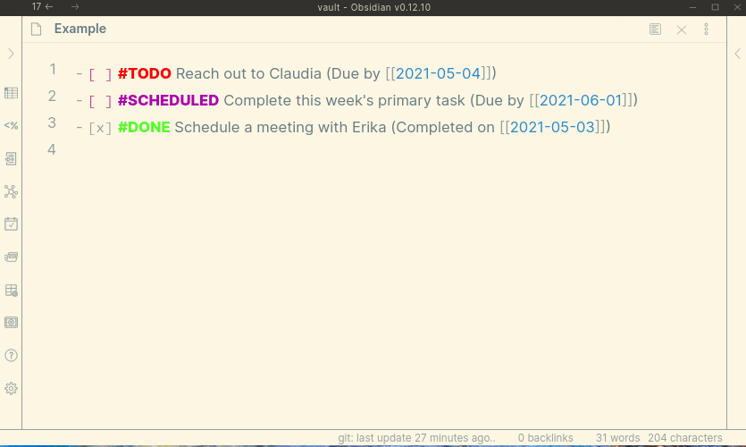
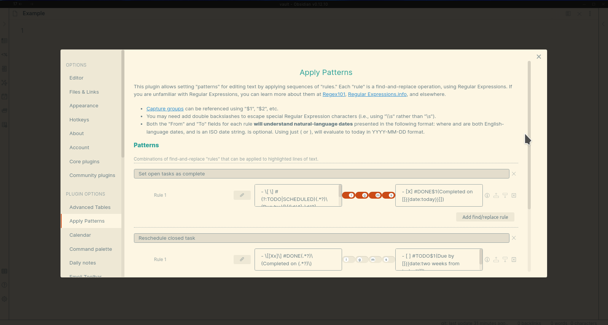

<h1 align="center">Obsidian Apply Patterns plugin</h1>

<p align="center">Apply collections of regular-expression find/replace rules on text in <a href="https://obsidian.md/">Obsidian notes</a>.</p>

This plugin allows creating collections of find-and-replace "rules," and applying them to selections or whole lines of a document from a searchable menu.

**Supports creating search and replace patterns of natural language dates, including ranges of dates.**

> Please submit bugs here: https://github.com/publicus/obsidian-apply-patterns-plugin
>
> Please submit ideas here: https://github.com/publicus/obsidian-apply-patterns-plugin/discussions/categories/ideas
>
> Please ask for help here: https://github.com/publicus/obsidian-apply-patterns-plugin/discussions/categories/q-a

---

<ul>
    <li><a href="#installation">Installation</a></li>
    <li><a href="#usage">Usage</a></li>
</ul>

For changes in each release, please check the releases page: https://github.com/publicus/obsidian-apply-patterns-plugin/releases

---

## Screenshots

- *The theme is [Solarized Light](https://github.com/Slowbad/obsidian-solarized).*
- *The theme has been enhanced for task management using [this CSS snippet](https://gist.github.com/publicus/30f289deb911cc8f8645c946e42f13a6). See [here](https://help.obsidian.md/Advanced+topics/Customizing+CSS) for instructions on incorporating CSS snippets in Obsidian.*



Two "Patterns" have been defined, each with one "rule." These settings can be imported into the plugin by copying this JSON to the clipboard and clicking the "Import from Clipboard" button in the plugin's settings tab within Obsidian:

<details>

```json
[
  {
    "name": "Set open tasks as complete",
    "done": false,
    "rules": [
      {
        "from": "- \\[ \\] #(?:TODO|SCHEDULED)(.*?)\\(Due by \\[\\[(\\d{4}-\\d{2}-\\d{2})\\]\\]\\)",
        "to": "- [X] #DONE$1(Completed on [[{{date:today}}]])",
        "caseInsensitive": true,
        "global": false,
        "sticky": false,
        "multiline": false,
        "disabled": false
      }
    ]
  },
  {
    "name": "Reschedule closed task",
    "done": false,
    "rules": [
      {
        "from": "- \\[[Xx]\\] #DONE(.*?)\\(Completed on (.*?)\\)",
        "to": "- [ ] #TODO$1(Due by [[{{date:two weeks from today}}]])",
        "caseInsensitive": false,
        "global": false,
        "multiline": false,
        "sticky": false
      }
    ]
  }
]
```
</details>


The first Pattern, "Set open tasks as complete," will affect lines that have an open checkbox and a `#TODO` or `#SCHEDULED` hashtag, as well as the phrase "(Due by...)" with a date. **It replaces a match with a closed checkbox, a `#DONE` hashtag, the original body of the line, and today's date.**

The second Pattern, "Reschedule closed task," will affect lines that have a closed checkbox (`-[x]`) and a `#DONE` hashtag, as well as the phrase "(Completed on...)". **It replaces a match with an open checkbox, a `#TODO` hashtag, and a "Due by" date that is two weeks in the future.**



The plugin's Settings tab allows creating and removing Patterns, as well as importing and exporting patterns using the system's clipboard. Rules can be moved up and down within Patterns, and validated as correct in their `{{date}}` strings and Regular Expression syntax. Each rule can also have [Regular Expression modes](https://www.regular-expressions.info/refmodifiers.html) set.

## Installation

Follow the steps below to install the plugin.

1. Search for "Apply Patterns" in Obsidian's community plugins browser
2. Enable the plugin in your Obsidian settings (find "Apply Patterns" under "Community plugins").
3. Check the "Apply Patterns" settings tab. Add one or more patterns.
4. (Optional) In the "Hotkeys" settings tab, add a hotkey for one or both of the "Apply Patterns..." commands.

## Usage

- Within a Pattern, rules execute sequentially. Thus, the output of Rule 1 is passed as input to Rule 2, and the output of Rule 2 is passed as input to Rule 3, etc. At the end of the set of rules, the final output is used to replace the text in the editor.
- The plugin provides two commands:
    - `Apply Patterns: Apply pattern to whole lines` will loop over each line that is selected in the editor, and apply the Pattern to the entirety of each line.
    - `Apply Patterns: Apply pattern to selection` will apply the Pattern to just the text selected in the editor, as one (potentially multi-line) string.
- Within the Settings tab:
    - Each rule can be disabled, moved up, and moved down in the pattern.
    - Clicking the information icon for a rule will open a Notice indicating whether the rule's `From` and `To` elements are valid.
    - Both the `From` and `To` text boxes can use `$1`, `$2`, etc. to refer to [capture groups](https://www.regular-expressions.info/refcapture.html) from the `From` box.
    - Both the `From` and `To` text boxes understand natural language dates (see below).

### Dates

Within the `From` and `To` text boxes in a rule's settings, one can express dates in natural language, using the following format:  
`{{date:start|end|format (default "YYYY-MM-DD")|separator (default "|")}}`

- `start`, `end`, `format`, and `separator` are all optional. `{{date}}` by itself will default to the current day in `YYYY-MM-DD` format.
- `format` can be any [format from DayJS](https://day.js.org/docs/en/parse/string-format#list-of-all-available-parsing-tokens).
- `start` and `end` are both parsed using [`chrono-node`](https://github.com/wanasit/chrono).
- Thus, the following formats are all valid:

| Date syntax                       | Output, if processed on 2021-08-03 |
| --------------------------------- | ---------------------------------- |
| {{date}}                          | 2021-08-03                         |
| {{date:today\|\|YYYY-MM}}         | 2021-08                            |
| {{date:tomorrow}}                 | 2021-08-04                         |
| {{date:two weeks from today}}     | 2021-08-17                         |
| {{date:today\|two days from now}} | 2021-08-03\|2021-08-04\|2021-08-05 |
| {{date:today\|tomorrow\|DD}}                                              |03\|04|
| {{date:today\|two days from now\|\|, }}                                         |2021-08-03, 2021-08-04, 2021-08-05|

This approach to expressing dates allows for powerfully searching for date ranges using Regular Expressions, or creating ranges of formatted dates in the output of a Pattern. For example, `[[{{date:today|tomorrow||]], [[}}]]` in the `To` text box of a rule will create the string "\[\[2021-08-03\]\], \[\[2021-08-04\]\]".

## Development
Clone the repository, run `yarn` to install the dependencies, and run `yarn dev` to compile the plugin and watch file changes.

## License

This plugin's code and documentation setup is based off of the [Obsidian Tasks](https://github.com/schemar/obsidian-tasks) plugin by [Martin Schenck](https://github.com/schemar). Like that plugin, this plugin is released under the [MIT license](./LICENSE).

# Todo

Automated tests are not currently included in this code for this repository. Assistance in this, particularly using the [Obsidian End-to-End testing approach](https://github.com/trashhalo/obsidian-plugin-e2e-test), is especially welcome!
